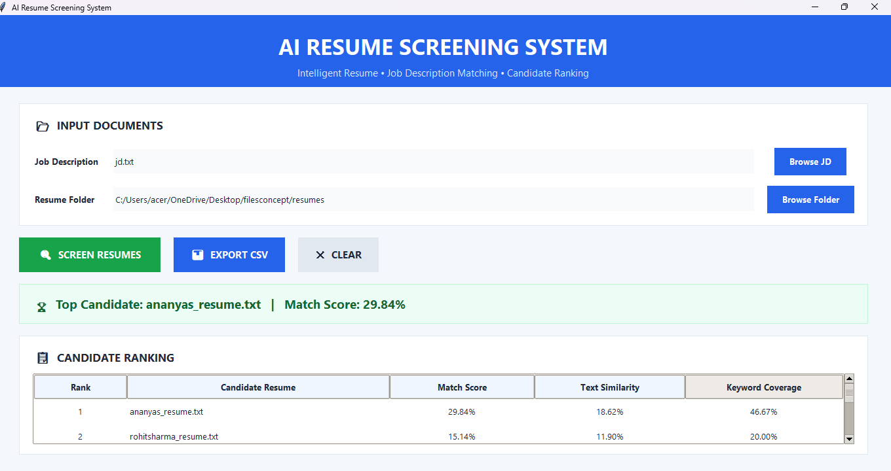

# AI Resume Screening System

An intelligent resume screening system that compares candidate resumes with a job description and ranks candidates based on their relevance.

## 🚀 Features

- Job Description based resume screening
- Multiple resume comparison
- Candidate ranking
- Match score calculation
- Text similarity analysis
- Keyword coverage analysis
- Matched keyword identification
- Missing keyword identification
- Graphical User Interface (GUI)
- CSV result export
- Supports different job roles through dynamic Job Descriptions

## 🛠️ Technologies Used

- Python
- Tkinter
- TF-IDF
- Cosine Similarity
- CSV
- Regular Expressions

## 📂 Project Structure

AI-Resume-Screener/
│
├── gui.py
├── resume_screener.py
├── jd.txt
└── README.md

## ⚙️ How It Works

1. Enter or select a Job Description.
2. Select the folder containing resumes.
3. Click **Screen Resumes**.
4. The system analyzes each resume against the Job Description.
5. Candidates are ranked according to their match score.
6. Results can be exported as a CSV file.

## 📊 Screening Process

The system considers:

- Text similarity between the Job Description and resume
- Keyword coverage
- Important keywords extracted from the Job Description

The final score is used to rank candidates.

## 🖥️ Running the Project

Make sure Python is installed.

Run:

```bash
python gui.py
## Screenshot

The following screenshot shows the main interface of the AI Resume Screener application.


